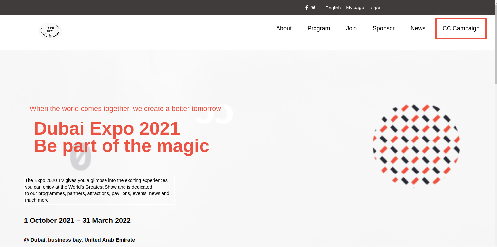

# conference-web

`This project is a capstone project.Here i created a branch to  to replicate the conference website CC-Global-Summit-2015continue worked on both the mobile and desktop version.The goal was to combine all the tools and best practices I just learned into a repo: Github Workflows, Linters, Flexbox, Grid system, Documenting my repo professionally With a perfect README.`

Additional description about the project and its features.

## Built With

- Html
- Css
- Linters
- Markdown

### LIVE LINK
 click here to view this project [Live link](https://gabrielcoder247.github.io/capstone-project/)

 ## Watch the video (https://www.loom.com/share/805a543ccd484918abc07f2449bac812)

## Getting Started
### Instructions on how to run my project locally on your machine
1. Go  to my git repository [DUBAI EXPO](https://github.com/gabrielcoder247/capstone-project/tree/dynamic-js)
2. then click on download zip folder
3. open the folder on your local machine via code editor
4. if you want to run the project, open it via the browser

👤 **Authors**

**GABRIEL NWACHUKWU**

- GitHub: [@githubhandle](https://github.com/gabrielcoder247)
- LinkedIn: [LinkedIn](https://www.linkedin.com/in/gabriel-nwachukwu-209613173/)

## 🤝 Contributing

Contributions, issues, and feature requests are welcome!

## Show your support

Give a ⭐️ if you like this project!
## acknowledgment
Original design idea by Cindy Shin in Behance.

## 📝 License

This project is [MIT](./MIT.md) licensed.
